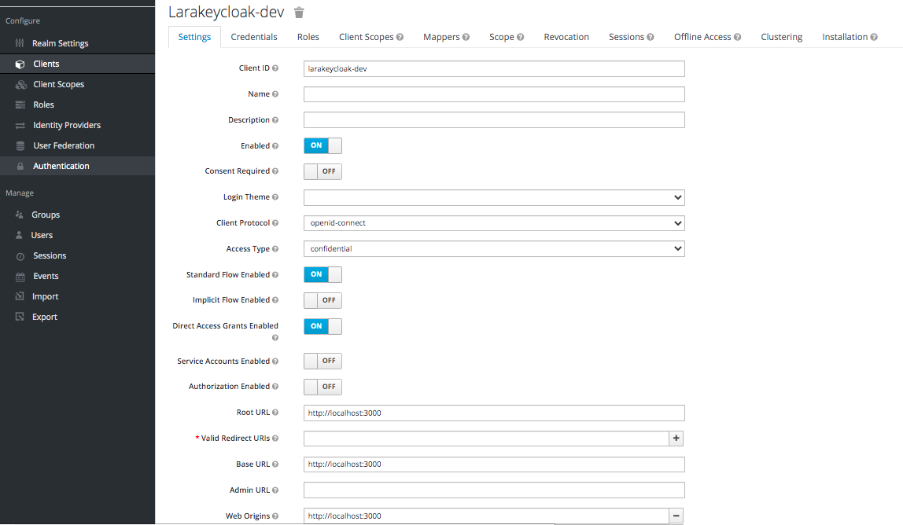
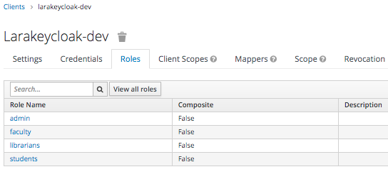
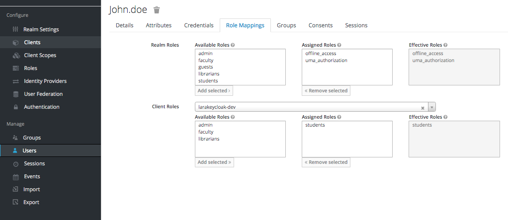

# LaraKeycloak
---
- [Overview](#overview)
- [Features](#features)
- [Keycloak Configurations](#keycloak-configure)
- [Installation](#install)
- [Configuration](#config)
- [Integration](#integrate)
- [Testing](#testing)

<a name="overview"></a>
## Overview
LaraKeycloak provides Authentication using [KeyCloak Socialite Provider](https://socialiteproviders.com/Keycloak/) and RBAC Authorization by checking user roles from [Keycloak](https://www.keycloak.org). 

<a name="features"></a>
## Features
- Provides Authentication using [KeyCloak Socialite Provider](https://socialiteproviders.com/Keycloak/)
- Provides Authorization by RBAC managed by KeyCloak

<a name="keycloak-configure"></a>
## Keycloak Configurations
Before installing LaraKeycloak, configure your Keycloak Server to add your application as Client. 
### Creating a Keycloak Client
<a href="./keycloak-client.png" target="_blank"></a>

### Add User Roles in Keycloak Client
<a href="./client-roles.png" target="_blank"></a>

### Create Users and Assign Roles
Create at least a Regular User and an Admin User, for testing Authorization later on.

<a href="./user-roles.png" target="_blank"></a>


<a name="install"></a>
## Installation
```
composer require peppertech/larakeycloak
```

<a name="configure"></a>
## Configuration
### Environment Variables
Variable | Required | Description | Default Value
--- | --- | --- | ---
KEYCLOAK_BASE_URL | Yes | Keycloak Server URL. ie. https://[keycloak server]/auth | none |
KEYCLOAK_REALMS | Yes | Keycloak Realm | none |
KEYCLOAK_CLIENT_ID | Yes | Keycloak Client ID | none |
KEYCLOAK_CLIENT_SECRET | Yes | OpenId Connect Client Secret | none |
KEYCLOAK_REDIRECT_URI | Yes | The default page to redirect users after login | /home |
KEYCLOAK_REALM_PUBLIC_KEY | Yes | Keycloak Realm RS256 Public Key | none |

<a name="integrate"></a>
## Integration

### Published Files
Run the following commands to publish the files to your app.
```
php artisan vendor:publish --tag="larakeycloak"
```
This will copy the following files:
- `app/Http/Controllers/LaraKeyController.php`, controller for the `/auth/redirect` and '/auth/callback` routes.
- `app/Policies/SampleAdminPolicy.php`, an example Admin Policy to secure certain pages in your application for `admin` role
- `resources/views/sample_admin_blade.php`, example Admin View with `/sample/admin` route.
- `app/Http/Controllers/SampleAdminController.php`, controller for the `/sample/admin` route.

### Routes
Create the following routes in your `app/routes/web.php`
```
Route::group(['middleware' => ['auth:web']], function () {
    ...
    Route::get('/sample/admin', 'SampleAdminController@index')->name('sample-admin');
});

Route::get('/auth/redirect', 'LaraKeycloakController@redirect')->name('auth-redirect');
Route::get('/auth/callback', 'LaraKeycloakController@callback')->name('auth-callback');

Route::get('logout', '\App\Http\Controllers\Auth\LoginController@logout');
```

Add the following `logout` method in your `LoginController`
```
use Illuminate\Support\Facades\Auth;
use PepperTech\LaraKeycloak\LaraKeycloak;

....
public function logout()
{
    $larakc = new LaraKeyCloak();
    $larakc->logout();
    Auth::guard('web')->logout();
    return redirect()->guest(route('main'));   // `main` is the route name of public homepage
}
```

### Socialite Keycloak Settings
Reference: https://socialiteproviders.com/Keycloak/#installation-basic-usage

- Add the following block in your `config/services.php`
```
'keycloak' => [    
        'client_id' => env('KEYCLOAK_CLIENT_ID'),  
        'client_secret' => env('KEYCLOAK_CLIENT_SECRET'),  
        'redirect' => env('KEYCLOAK_REDIRECT_URI'),
        'base_url' => env('KEYCLOAK_BASE_URL'),
        'realms' => env('KEYCLOAK_REALMS'),
        'realm_public_key' => env('KEYCLOAK_REALM_PUBLIC_KEY'),
    ],
```

- In `app/Providers/EventServiceProvider.php`, add the following:
```
use SocialiteProviders\Manager\SocialiteWasCalled;

protected $listen = [
        ....
        SocialiteWasCalled::class => [
            // add your listeners (aka providers) here
            'SocialiteProviders\\Keycloak\\KeycloakExtendSocialite@handle',
        ],
    ];
```

- In `config/app.php` add the `SocialiteProviders\Manager\ServiceProvider::class` and comment-out `Laravel\Socialite\SocialiteServiceProvider::class` if you have added this before.
```
'providers' => [
    ...
    // Laravel\Socialite\SocialiteServiceProvider::class,   
    SocialiteProviders\Manager\ServiceProvider::class,
]
```
### Auth Middleware
- In `app/Http/Middleware/Authenticate.php`, change the `redirectTo` method. This change will make the redirection to Keycloak Login when an unauthenticated user access a protect part of the website.
```
protected function redirectTo($request)
{
    if (! Auth::check()) {
        return route('auth-redirect');
    }   
}
```

<a name="authz"></a>
## Authorization
Authorization is provided by roles of user from Keycloak. `PepperTech\LaraKeycloak\LaraKeycloak` class has a public method `hasRole` that checks if currently logged-in user has that role. `hasRole` can be used with [Laravel Authorization](https://laravel.com/docs/7.x/authorization)

### Defining Gates
- Define your Gate in `app/Providers/AuthServiceProvider.php` `boot` method
```
public function boot()
    {
        $this->registerPolicies();

        Gate::define('view-admin', [SampleAdminPolicy::class, 'view']);
        // define more Gates here
    }
```
### Policies
- An example Policy is provided in `app/Policies/SampleAdminPolicy.php` that uses the LaraKeycloak `hasRole` method.
- An example Admin View Controller is also provided at `app/Htttp/Controllers/SampleAdminController.php`. Inspect how Gates are used here to check the user's authorization in viewing a page.


<a name="testing"></a>
## Testing
- To test if everything is working, navigate to `http://[your domain]/sample/admin`. This should redirct to Keycloak Login Page.
- Login with a Keycloak User that has 'admin' role.
- Upon login, you should be able to see the Sample Admin Page.
- Logout and go to `http://[your domain]/sample/admin` again. This time, login with a user that does not have an `admin` role. 
- Upon login, you should see a 403 Unauthorized Page. 


